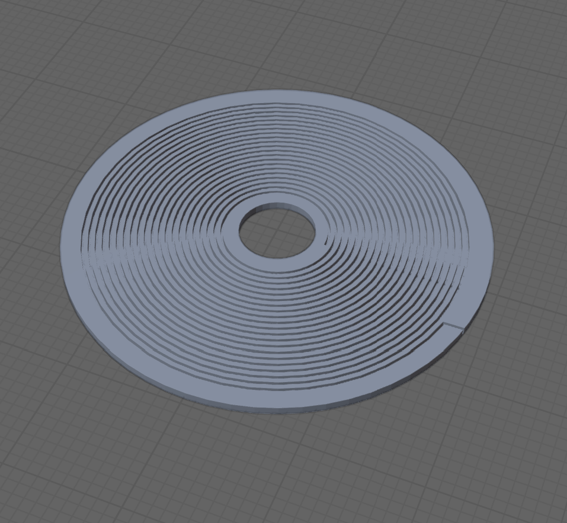
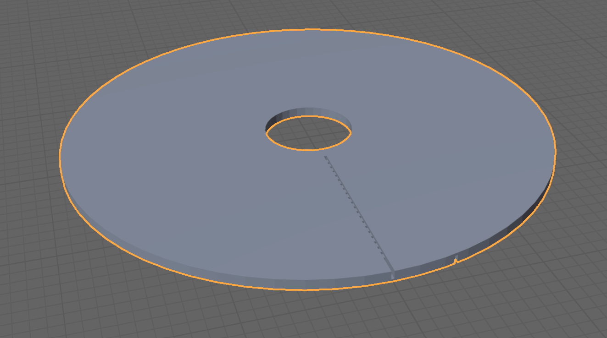

# **QI Transmission**

### Wireless Energy Transmission

> [!WARNING]
> Page Under Construction

 

 
 

## Description
Wireless chargers that comply with the Qi standard for charging mobile phones are inexpensive and widely available. Why not experiment a bit with the charger to wirelessly charge a (self-built) battery device, for example? Simply placing a coil on the charger to tap into the power is unfortunately not sufficient. A data transmission embedded in the energy flow according to the Qi protocol must initiate and then continuously maintain the power flow.

In this project, an inexpensive AVR controller with suitable hardware and software is used, and a simple method for manufacturing a flat coil is described.
 

## Soft- and Hardware
[**-> Source**](source)  

Breadboard Build, an old fashioned bulb is being lit  

 

Schematic (click to enlarge)  

 

# Flat Coil  
Two STL files for coils are in the repository, the 3d printer nozzle diameter  
for these prints must be 0.4 mm, you can try to fabricate more dense coils  
with 0.2 mm nozzles  
[-> wire 0.21 mm nozzle 0.4 mm](stl/qi_coil_021_04.stl)  
[-> wire 0.3 mm nozzle 0.4 mm](stl/qi_coil_03_04.stl)
 
 

Some examples for flat coils, a commercial available flat coil, a self winded  
round one a coil extracted from a hard disk and a self made oval one  

 

An easy method of winding a flat coil is to 3D print a carrier with grooves  
to sink in enameled copper wire, if diameters of wire and groove match, no  
glue is necessary to keep the wire on track  

   

Bottom side with groove to lead the wire outside  

 

While commercial available flat coils are able to deliver some ampere, these  
self made coils are cheap and easy to wind but will deliver some 100 mA only  

 

Bottom side  
 
 

Ferro foils on the back of the flat coils will enhance efficiency of wireless  
energy transmission, only **pure** ferro foils for sticking magnets on it, not the  
self magnetic ones, will work  
 
 

 
 

**Edited and Developed with vsCode**  
https://code.visualstudio.com/  

 

---

[qrt@qland.de](mailto:qrt@qland.de) 240524
