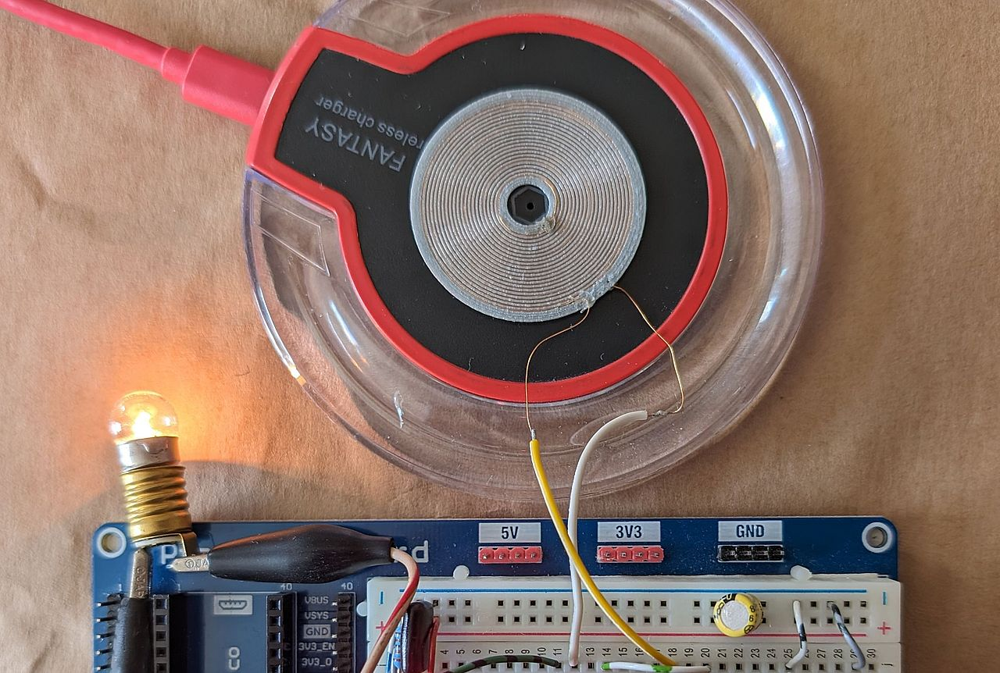
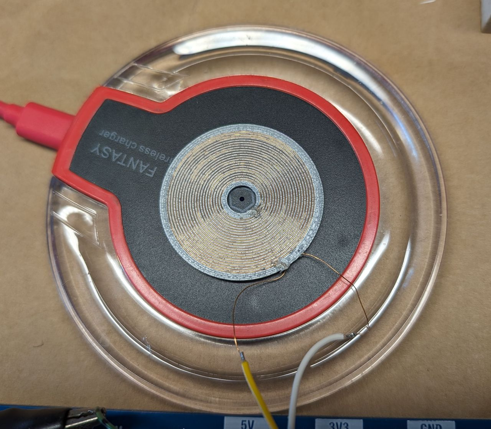
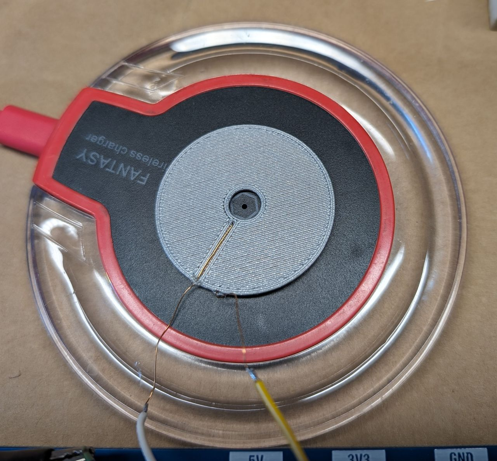
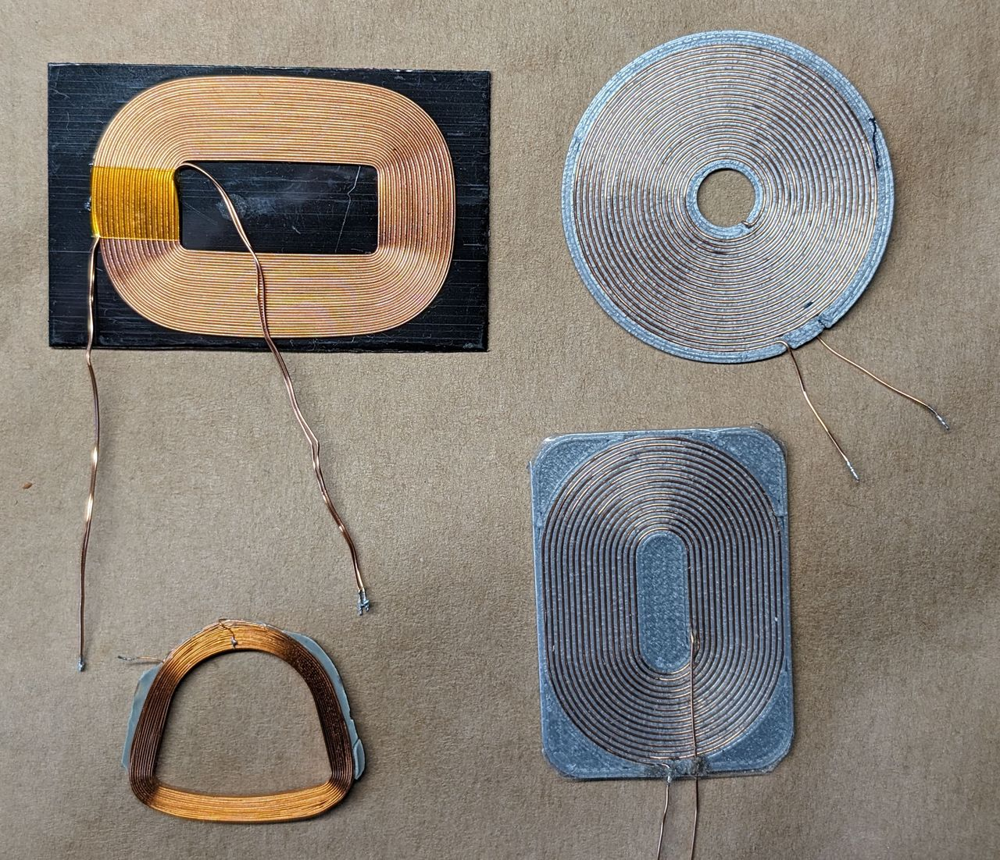
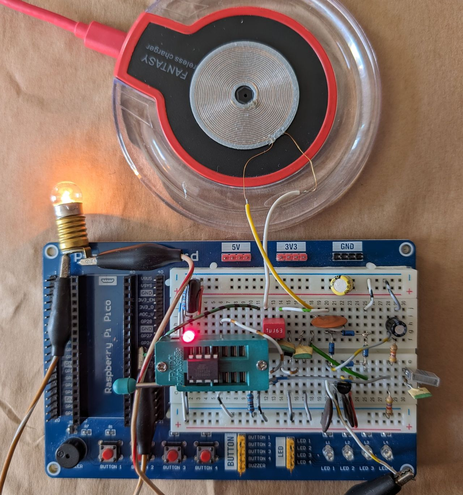
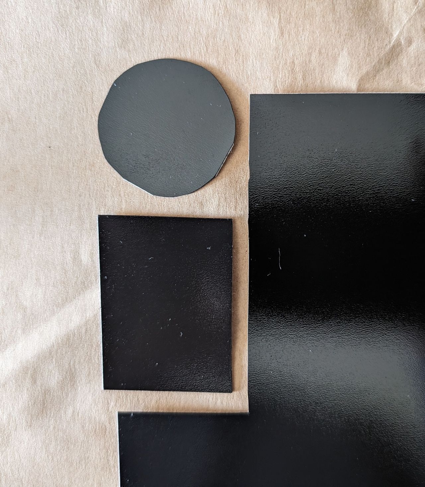
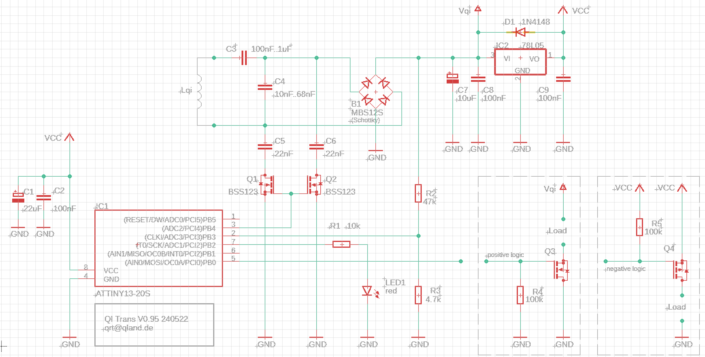

# **QI Transmission**

### Wireless Energy Transmission

> [!WARNING]
> Page Under Construction

 

 

[-> source](source)  
[-> coil stl](stl)

 

## Description
An inexpensive AVR ATTINY13A and a self made flat coil

 
 

 

 
 

 
 

3D views  
[-> coil 0.21 0.4](stl/qi_coil_021_04.stl)  
[-> coil 0.3 0.4](stl/qi_coil_03_04.stl)

 

## Schematic

 
 
 

**Edited and Developed with vsCode**  
https://code.visualstudio.com/  

 

---

[qrt@qland.de](mailto:qrt@qland.de) 240523
